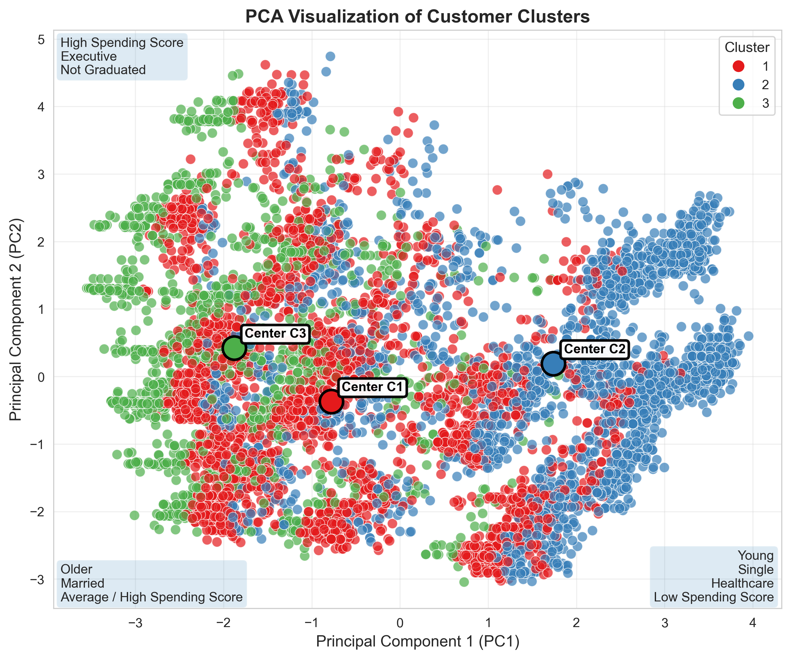

# Customer Segmentation
## Description

This project applies **K-Prototypes clustering** to segment customers into three meaningful groups based on demographic, household, profession, and spending behavior data.  

Using **PCA visualization**, the clusters show clear behavioral patterns:

- <strong>Cluster 1 – Stable Mid-Life Creative Households</strong>: middle-aged, balanced, moderate spending  
- <strong>Cluster 2 – Young Budget Healthcare Starters</strong>: younger, healthcare-oriented, low spending  
- <strong>Cluster 3 – Senior Premium Professionals</strong>: older, affluent, higher-value customers  

  

## Dataset
- Dataset: [Customer Segmentation](https://www.kaggle.com/datasets/vetrirah/customer/data)
- Column description: We drop `Var_1` and `Segmentation` since they have no help of our analysis. We construct a additional column `AgeCap` to group age into `0-18`, `19-25`, `26-35`, `36-46`,`47+`.

| Column            | data type | Description                                                        |
|-------------------|----------|--------------------------------------------------------------------|
| ID                | int64    |
| Gender            | str      |
| Ever_Married      | str      | Marital status of the customer.                                    |
| Age               | int64    |
| Graduated         | str      |
| Profession        | str      |
| Work_Experience   | float64  | Work Experience in years.                                          |
| Spending_Score    | str      |
| Family_Size       | float64  | Number of family members for the customer (including the customer). |

- Missing values:

| Column          | count  |
|-----------------|--------|
| ID              | 0      |
| Gender          | 0      |
| Ever_Married    | 140    |
| Age             | 0      |
| Graduated       | 78     |
| Profession      | 124    |
| Work_Experience | 829    |
| Spending_Score  | 0      |
| Family_Size     | 335    |
| AgeCat          | 0      |

## Missing Values
We try to find ways to insert appropriate values of each missing values of `Ever_Married`, `Graduated`, `Profession`, `Work_Experience`, and `Family_Size`.

### `Ever_Married`
- All average / high `Spending_Score` are married.
- People with Healthcare profession are mostly not married.
- 47+ People are mostly married / 19-25 People are mostly not married / 26-35 People are mostly not married.
- For people in 36-46, they're mostly married, apart for those in the Marketing field.

### `Graduated`
- 0-18 People are mostly not graduated / 19-25 People are mostly not graduated / 47+ People are mostly graduated
- Most Artist are graduated.
- There is more chance that married people are Graduated.

### `Profession`
- People that are 60+ years old are mostly Artist if they have an average `Spending_Score` and are mostly Lawyers if they have a High/Low `Spending_Score`.
- Most graduates are Artist.
- 0-18 and 19-25 People are mostly with Healthcare profession
- 47-60 People are mostly Artist.
- Not Married People have a Healthcare profession / Married People are Artists.

### `Work_Experience`
- There weren't too many statistical changes after using the `ffill()` filling method, so we use it.

### `Family_Size`
- There weren't too many statistical changes after using the `ffill()` filling method, so we use it.

## Processing
We will encode our discrete fields for our machine learning model so things like (Yes/No) (Male / Female) will become (1/0).

| Profession    | Number |
|---------------|--------|
| Healthcare    | 1      |
| Engineer      | 2      |
| Lawyer        | 3      |
| Entertainment | 4      |
| Artist        | 5      |
| Executive     | 6      |
| Doctor        | 7      |
| Homemaker     | 8      |
| Marketing     | 9      |

| Spending Score | Number |
|----------------|--------|
| Low            | 1      |
| Average        | 2      |
| High           | 3      |

## Clustering - K Prototypes

Since the dataset contains both numerical and categorical features, we apply the K-Prototypes clustering algorithm, which combines the strengths of K-Means (for numerical data) and K-Modes (for categorical data).
- Categorical variables: `Gender`, `Ever_Married`, `Graduated`, `Profession`, `Work_Experience`, `Spending_Score`
- Numerical variables: `Age`, `Family_Size`

When the data was divided into three clusters, the reduction in cost showed the largest improvement rate. 
Therefore, we segmented the customer data into three clusters.

  

## Analysis

### Stable Mid-Life Creative Households (Cluster 1)

**Key Characteristics**  
Middle-aged, married, moderate spending

**Business Insight**  
This group appears financially stable and family-oriented, with moderate purchasing behavior. 
They may respond well to lifestyle products, family-focused offers, and value-based promotions.

| Feature        | Description                                              |
|----------------|----------------------------------------------------------|
| Family Size    | Mostly 2 / Sometimes 1 / Sometimes 3                     |
| Average Age    | 45                                                       |
| Jobs           | Primarily Artist, followed by Entertainment and Engineer |

| Categorical variables | Yes   | No    |
|-----------------------|-------|-------|
| Ever Married          | 75.1% | 24.9% |
| Graduated             | 78.1% | 21.9% |

|                   | Low   | Avg   | High  |
|-------------------|-------|-------|-------|
| Spending Score    | 48.0% | 38.0% | 14.0% |

### Young Budget Healthcare Starters (Cluster 2)

**Key Characteristics**  
Young, low spending, healthcare-oriented

**Business Insight**  
This group likely represents younger early-career customers who are price-sensitive and budget-conscious. 
They are ideal targets for affordable products, entry-level services, discounts, and loyalty-building campaigns.

| Feature        | Description                                         |
|----------------|-----------------------------------------------------|
| Family Size    | Evenly distributed across 2, 3, and 4 members       |
| Average Age    | 27                                                  |
| Jobs           | Primarily Healthcare, followed by Artist and Doctor |

| Categorical variables | Yes   | No    |
|-----------------------|-------|-------|
| Ever Married          | 75.5% | 24.5% |
| Graduated             | 56.9% | 43.1% |

|                   | Low   | Avg   | High |
|-------------------|-------|-------|------|
| Spending Score    | 83.8% | 11.4% | 4.9% |

### Senior Premium Professionals (Cluster 3)

**Key Characteristics**  
Older, affluent, high-value customers

**Business Insight**  
This segment likely represents affluent and established senior customers. 
They are suitable for premium services, high-value products, personalized experiences, and trust-based relationship marketing.

| Feature        | Description                                        |
|----------------|----------------------------------------------------|
| Family Size    | Mostly 2 / Sometimes 1 / Sometimes 3               |
| Average Age    | 70                                                 |
| Jobs           | Primarily Lawyer, followed by Artist and Executive |

| Categorical variables | Yes   | No    |
|-----------------------|-------|-------|
| Ever Married          | 93.8% | 6.2%  |
| Graduated             | 67.2% | 32.8% |

|                   | Low   | Avg   | High  |
|-------------------|-------|-------|-------|
| Spending Score    | 39.3% | 22.0% | 38.7% |

## Principal Component Analysis (PCA)
To better visualize the clustering results, we applied Principal Component Analysis (PCA) to reduce the high-dimensional customer features into two principal components.

### Explained Variance

- PC1 explains **20.3%** of the total variance
- PC2 explains **11.7%** of the total variance
- Combined, the first two components explain **32.0%** of the variance

This indicates that customer characteristics are distributed across multiple dimensions.

### Interpretation of Principal Components

#### PC1 – Life Stage & Spending Dimension

Customers on the positive side of PC1 tend to be:

- Younger
- Single
- Healthcare-related professions
- Low spending score

Customers on the negative side of PC1 tend to be:

- Older
- Married
- Average / High spending score

#### PC2 – Career & Premium Behavior Dimension

Customers with higher PC2 values tend to be:

- High spending score
- Executive professions
- Not graduated

### PCA Visualization

The scatter plot below shows the three customer clusters projected onto the first two principal components.

  

### Validation

<strong>Young Budget Healthcare Starters (Cluster 2)</strong> 
This segment is positioned in the lower-right region of the PCA plot, which aligns with its profile of younger customers, lower marriage rates, strong representation in Healthcare-related professions, and predominantly low spending behavior.

<strong>Senior Premium Professionals (Cluster 3)</strong> 
This segment appears on the left side of the PCA plot, reflecting customers who are older, more likely to be married, and have relatively stronger purchasing power with higher spending levels.

<strong>Stable Mid-Life Creative Households (Cluster 1)</strong> 
This segment is located in the central-left region of the PCA plot, indicating a more balanced customer profile with moderate values across key demographic and spending characteristics.